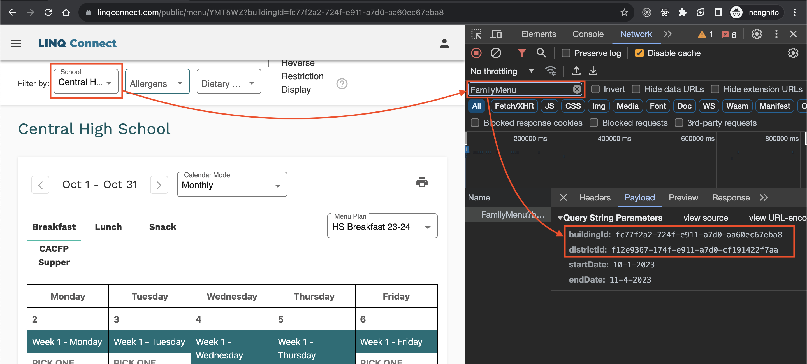

# MMM-TitanSchoolMealMenu

A module for the [MagicMirror²](https://github.com/MagicMirrorOrg/MagicMirror) framework that retrieves a school meal menu from the LinqConnect API (api.linqconnect.com). LinqConnect was formerly known as "Titan Schools" (family.titank12.com).

---


## Install

Clone `MMM-TitanSchoolMealMenu` into the modules folder of your MagicMirror² installation:

```bash
cd ~/MagicMirror/modules
```

## Update

Go to the `MMM-TitanSchoolMealMenu` folder inside MagicMirror² modules folder and pull the latest version from GitHub:

```bash
cd ~/MagicMirror/modules/MMM-TitanSchoolMealMenu
git pull
```

Restart MagicMirror² after updating.

## Usage

Add this to your MagicMirror² `config.js`:

```javascript
{
    module: "MMM-TitanSchoolMealMenu",
    position: "top_left",
    header: "School Menu",
    config: {
        size: 'medium', // Optional: 'small', 'medium', 'large'; Default: 'medium'
        buildingId: '23125610-cbbc-eb11-a2cb-82fe13669c55',
        districtId: '93f76ff0-2eb7-eb11-a2c4-e816644282bd',
        updateIntervalMs: 3600000, // Optional: Milliseconds between updates; Default: 3600000 (1 hour)
        numberOfDaysToDisplay: 3, // Optional: 0 - 5; Default: 3
        recipeCategoriesToInclude: [
            "Entrees",
            "Grain"
            // , "Fruit"
            // , "Vegetable"
            // , "Milk"
            // , "Condiment"
            // , "Extra"
        ],
        debug: false // Optional: boolean; Default: false; Setting this to true will output verbose logs
    },
},
```

You can also track multiple school menus by listing the module multiple times in your `config.js` file (each config will probably have a different `buildingId`/`districtId`):

```javascript
{
    module: "MMM-TitanSchoolMealMenu",
    position: "top_right",
    header: "The Derek Zoolander Center for Kids Who Can't Read Good and Wanna Learn to Do Other Stuff Good Too.",
    config: {
        buildingId: '7833a90f-a4bc-eb11-a2cb-8711b287b526',
        districtId: '93f76ff0-2eb7-eb11-a2c4-e816644282bd',
    },
},
{
    module: "MMM-TitanSchoolMealMenu",
    position: "top_left",
    header: "School for Kid #1",
    config: {
        buildingId: "9017b6ae-a3bc-eb11-a2cb-82fe13669c55",
        districtId: "93f76ff0-2eb7-eb11-a2c4-e816644282bd",
    }
},
```


### Options

These are the possible options:

| Option                          | Description    |
|---------------------------------|----------------|
| `buildingId`                    | <p>The buildingId found on the LinqConnect webpage.</p><p>**REQUIRED**<br>**Type:** `string`<br>**Example:** `"23125610-cbbc-eb11-a2cb-82fe13669c55"`<br>**Default value:** none</p><p>**NOTE:** See [Finding your `buildingId` and `districtId`](#finding-your-buildingid-and-districtid) below</p>|
| `districtId`                    | <p>The districtId found on the LinqConnect webpage.</p><p>**REQUIRED**<br>**Type:** `string`<br>**Example:** `"93f76ff0-2eb7-eb11-a2c4-e816644282bd"`<br>**Default value:** none</p><p>**NOTE:** See [Finding your `buildingId` and `districtId`](#finding-your-buildingid-and-districtid) below</p>|
| `retryDelayMs`                  | <p>How long to wait to retry after an error from the API.</p><p>**Type:** `integer`<br>**Possible values:** `0` - `?`<br>**Default value:** `20000` (20 seconds)<br>**Unit:** `milliseconds`</p>|
| `updateIntervalMs`              | <p>The time in milliseconds when the menu should be updated.</p><p>**Type:** `integer`<br>**Possible values:** `0` - `?`<br>**Default value:** `3600000` (1 hour)<br>**Unit:** `milliseconds`</p>|
| `numberOfDaysToDisplay`         | <p>The number of days to display menu items.</p><p>**Type:** `integer`<br>**Possible values:** `0` - `?`<br>**Example:** `5`<br>**Default value:** `3`<br>**Unit:** `days`</p><p>**Note:** If `displayCurrentWeek` is `true`, this will be the number of days after the first day of the week, not today.</p>|
| `size`                          | <p>The css class for the font size.</p><p>**Type:** `string`<br>**Possible values:** `x-small`, `small`, `medium`, `large`, `xlarge`<br>**Example:** `"small"`<br>**Default value:** `medium`</p><p>**Note:** You can use any css class here, not just font sizes.</p>|
| `todayClass`                    | <p>The css class for today's meal.</p><p>**Type:** `string`<br>**Possible values:** `x-small`, `small`, `medium`, `large`, `xlarge`<br>**Example:** `"medium bright"`<br>**Default value:** `large`</p><p>**Note:** You can use any css class here, not just font sizes.</p>|
| `displayCurrentWeek`            | <p>Display meals starting from the first day of the week instead of today.</p><p>**Type:** `boolean`<br>**Default value:** `false`<br>**Possible values:** `true` and `false`|
| `weekStartsOnMonday`            | <p>Show Monday as the first day of the week. Set to `true` to show Monday as the first day of the week.</p><p>**Type:** `boolean`<br>**Default value:** `false`<br>**Possible values:** `true` and `false`|
| `hideEmptyDays`                 | <p>Hide days without any meals.</p><p>**Type:** `boolean`<br>**Default value:** `false`<br>**Possible values:** `true` and `false`|
| `hideEmptyMeals`                | <p>Hide meals that are empty.</p><p>**Type:** `boolean`<br>**Default value:** `false`<br>**Possible values:** `true` and `false`|
| `recipeCategoriesToInclude`     | <p>An array of recipe categories to display.</p><p>**Type:** `array`<br>**Example:** `[ "Entrees", "Grain", "Fruit", "Vegetable" ]`<br>**Default value:** `[ "Entrees", "Grain" ]`<br>**Possible values:** Any valid category in the API as an array. (See example)</p><p>**Note:** Your district might not use the categories in this module. You will need to find the categories by visting the website.</p><p>**Note 2:** If this is blank (`[]`), all categories will be selected.</p>|
| `debug`                         | <p>Setting this to `true` will output verbose logs.</p><p>**Type:** `boolean`<br>**Default value:** `false`<br>**Possible values:** `true` and `false`|

---

## Finding your `buildingId` and `districtId`

1. Go to the LinqConnect webpage and search for your school district: <https://linqconnect.com/>


2. Select your school from the dropdown and use your browser's developer tools to inspect the resulting request to the `/FamilyMenu` endpoint. The `districtId` and `buildingId` will be present as query string parameters on this requests.


